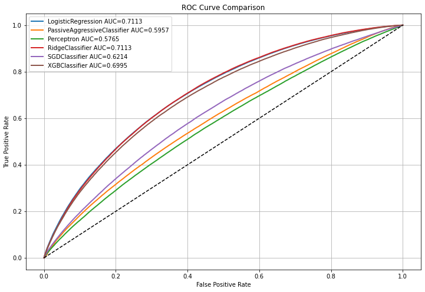

# Loan Default Prediction with XGBoost

## Project Overview

This project builds a machine learning pipeline to predict borrower default risk using historical loan records.  
The task is formulated as a binary classification problem and focuses on evaluating multiple models under a time-based validation framework.

The objective is to identify high-risk borrowers and simulate a real-world credit risk modeling scenario.

- **Target Variable:** `is_default`
- **Task Type:** Binary Classification
- **Goal:** Predict whether a borrower will default on a loan

---

## Dataset Description

This project uses a public loan dataset containing borrower profile information, credit history, repayment behavior, and loan application attributes.

### Dataset Size

- **Total Records:** 800,000+
- **Time Range:** 2012 - 2018
- **Total Features:** 45+

### Target Variable

| Column Name | Description |
|------------|-------------|
| is_default | 0 = Non-default, 1 = Default |

### Example Features

| Feature Name | Description |
|-------------|-------------|
| loan_amnt | Loan amount |
| term | Loan term |
| interest_rate | Interest rate |
| installment | Installment payment |
| grade | Credit grade |
| annual_income | Annual income |
| dti | Debt-to-income ratio |
| fico_range_low | Lower bound of FICO score |
| fico_range_high | Upper bound of FICO score |
| open_acc | Number of open credit lines |
| revol_bal | Revolving balance |
| total_acc | Total number of credit accounts |

---

## Data Preprocessing

The following preprocessing steps were applied before model training:

- Removed missing values
- Converted categorical variables into numerical values
- Encoded credit grade levels
- Standardized numerical features
- Selected important variables using Random Forest feature importance
- Constructed yearly train-test splits

---

## Validation Strategy

To better simulate real-world forecasting conditions, a rolling time-window validation method was used:

- Train on 2012 → Test on 2013  
- Train on 2013 → Test on 2014  
- Train on 2014 → Test on 2015  
- Train on 2015 → Test on 2016  
- Train on 2016 → Test on 2017  
- Final Test on 2018

This method reduces data leakage and reflects practical deployment scenarios.

---

## Models Compared

The following machine learning models were evaluated:

- Logistic Regression
- Passive Aggressive Classifier
- Perceptron
- Ridge Classifier
- SGD Classifier
- XGBoost Classifier

---

## Model Performance (AUC)

| Model | AUC |
|------|------|
| RidgeClassifier | 0.7113 |
| LogisticRegression | 0.7113 |
| XGBoost | 0.6995 |
| SGDClassifier | 0.6214 |
| PassiveAggressiveClassifier | 0.5957 |
| Perceptron | 0.5765 |

---

## ROC Curve



---

## Key Skills Demonstrated

- Machine Learning Classification
- Credit Risk Modeling
- Feature Engineering
- Model Evaluation
- Time-Series Validation
- Python Data Analysis
- Financial Data Processing

---

## Tech Stack

- Python
- Pandas
- NumPy
- Scikit-learn
- XGBoost
- Matplotlib

---

## Notes

The raw dataset is not uploaded in this repository due to file size limitations and possible licensing restrictions.

Users may replace the local dataset path with their own copy.

Example:

```python
DATA_PATH = r"D:\Desktop\数据集.csv"
